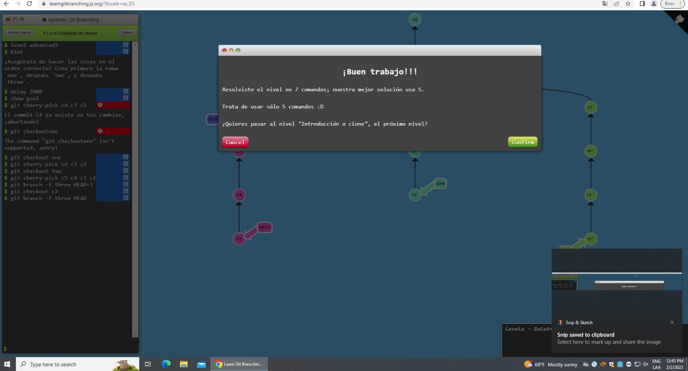
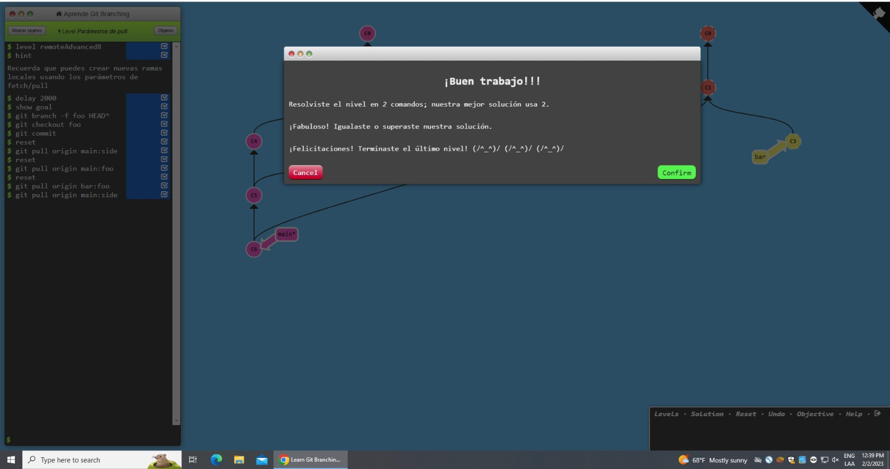

# CVDS-LAB1

### README de juan sebastian cepeda saray
Actualmente estudiante de **ING.sistmas** de la *Escuela colombiana de ingenieria Julio Garavito*\
me encuentro cursando las siguiente materias:
1. RECO
2. CVDS
3. PRYE
4. EGI2
5. ESCU
> Viendo un poco mas a profundidad las materias
> 
>> **PRYE** -> probabilidad y estadistica la cual cuenta con un peso de `4` creditos
>
>
>> **ESCU** -> estetica y cultura la cual cuenta con un peso de `2` creditos
>
>
>> **CVDS** -> ciclos de vida del desarrolo de sogftware la cual cuenta con un peso de `4` creditos
>
>
>> **EGI2** -> ingls 2 la cual cuenta con un peso de `2` creditos
>
>
>> **RECO** -> redes de computadores la cual cuenta con un peso de `4` creditos
>
> Lo que significa que actualmente he completado de manera satisfactoria más del 50% de la carrera\
*si quieres saber un poco mas sobre la universidad* [entra aquí](https://www.escuelaing.edu.co/es/)

# EVIDENCIAS DE GIT LEARNIG

## Parte Principal
- \
  
## Parte remota
- \
  
